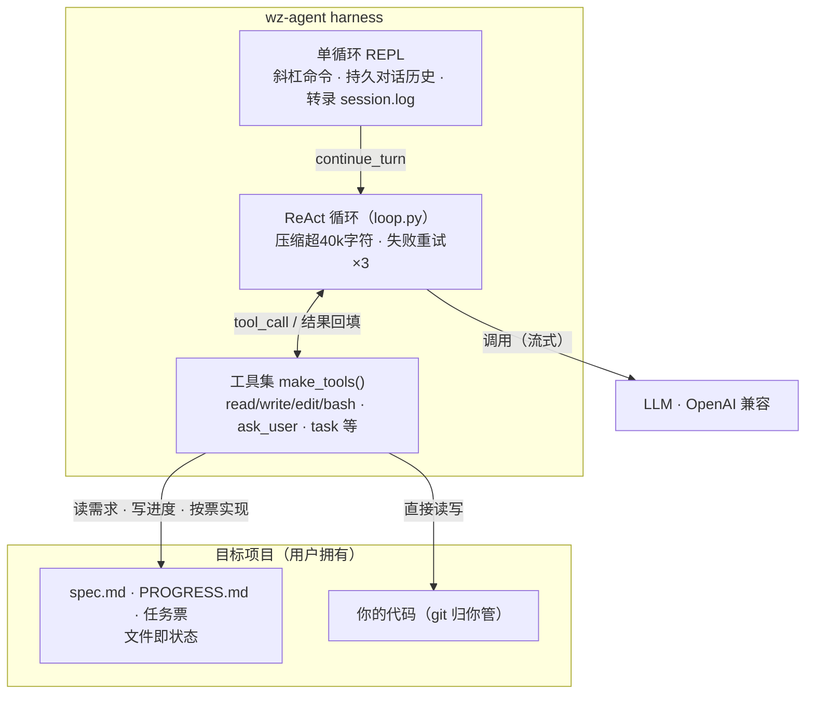
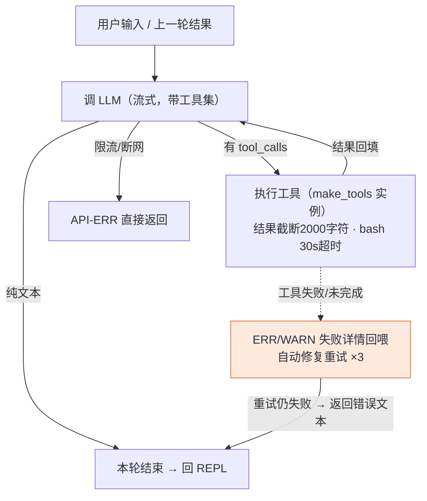
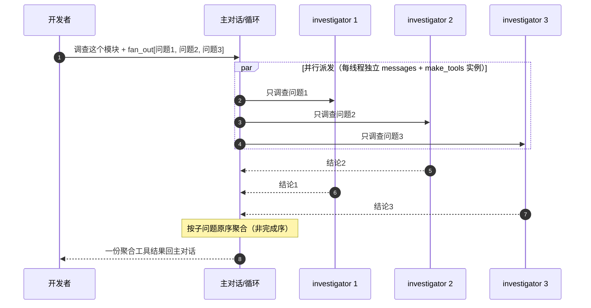
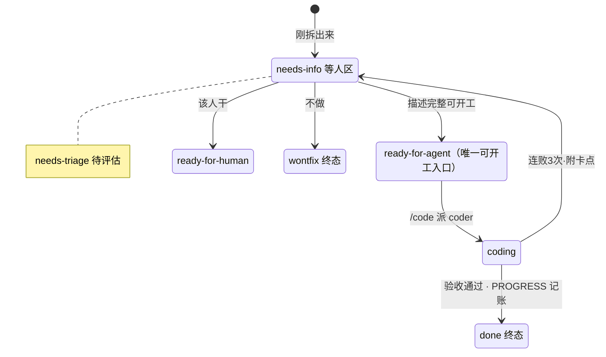

# wz-agent 架构介绍

## 背景：什么是 Agent 与 Harness

**Agent（智能体）的能力来自大模型本身。** 理解需求、拆解任务、编写代码、自我修正——
这些不是外部代码赋予的，而是模型在数以万亿计的人类文本与代码上训练出来的。
但模型只会输出文字：它没有手，不能读写你的文件、不能运行命令、看不到修改结果。

**Harness（装具）就是给模型的这双手**——一个围绕模型 API 构建的本地程序：

```
循环    把用户输入和对话历史发给模型 → 模型决定调用什么工具 →
        harness 执行并把结果喂回去 → 重复，直到模型认为任务完成
工具    文件读写、代码编辑、命令执行、向用户提问——模型借工具行动
上下文  维护对话历史；过长时裁剪，重要状态落在文件里以防丢失
边界    危险操作拦截、人机交互约定——保证 agent 不做出格的事
```

业内常说 **Agent 产品 = 大模型 + Harness**：模型是驾驶者，harness 是车。
同一个模型配不同的 harness，体验天差地别——差距全在车上。

wz-agent 就是一辆自建的车：它把 DeepSeek / GLM 这类 OpenAI 兼容的模型 API
装进一个约 3.3k 行 Python 的 harness 里，使模型能真正在你的项目目录里读写代码、
运行验证、管理任务。下文按模块介绍这辆车是怎么造的。

---

## 它能做到我需要的事吗（图示版）

> 本文面向想了解或接手 wz-agent 的开发者：按照 coding agent 的标准机制模块，
> 逐个说明它在 wz-agent 中如何实现、有哪些考虑。
>
> 规模：约 3.3k 行 Python。支持任何 OpenAI 兼容 API（默认 DeepSeek）。158 项测试。
> **图示版**：架构内容以 Mermaid 图呈现（GitHub / VS Code / Typora 直接渲染），文字版见 [agent-architecture.md](agent-architecture.md)。

---

## 图目录

四张图均为 Mermaid 代码块内嵌（GitHub / VS Code 预览 / Typora / Obsidian 原生渲染），见下方各章节。
---

## 它能做到我需要的事吗

**① 能自动生成代码，多个 agent 协同完成任务吗？——能。**

- 生成代码是核心场景：需求澄清写入 spec.md 后，agent 按模块自主编码——
  规划模块顺序、逐个实现、每步用 bash 跑验证、出错自动修复（详见
  [Agent 循环](#agent-循环)与[提示词体系](#提示词体系)）。
- 多 agent 协同走"主对话 + 子 agent"模型（[子 agent](#子-agent-task-工具)）：
  主 agent 遇到可委派的工作就发起一次 task 工具调用，每种角色一个独立上下文。
  目前内置两个角色：`investigator`（只读调查，并行扇出最多 4 路）和 `coder`
  （受命实现单个编码任务）。协同方式有意保持为"主从委派"而非"多leader 对话"：
  上下文隔离让每个子 agent 只消化自己的任务，结果聚合回主对话决策。
- 任务量大时可以拆票推进（见[任务票](#任务票-scratch-可执行流水线)）：
  spec → 垂直切片成票 → 逐票派 coder 实现 → 验收置 done。

**② 可以问答式修复现有代码吗？——能。**

- 纯问答：直接问它代码问题（如"数据流是怎么走的"），它读你的项目后回答，
  不改任何文件；复杂问题可交给 investigator 子 agent 深挖后汇报。
- 修复：描述症状或粘贴报错，agent 先 read 定位、再 edit 精准修改
  （绝不整文件重写）、然后跑测试验证（[修改反馈](#计划与进度-specmd-和-progressmd)
  一节及工具系统）。修坏的代价也被控住——版本控制在你手里，/clear 与项目文件无关。

**③ 有本地记忆系统来复盘当前工程吗？——有，但它不是数据库，是文件。**

wz-agent 的记忆由三层文件构成，全部存在目标项目里（[计划与进度](#计划与进度-specmd-和-progressmd)、
[任务票](#任务票-scratch-可执行流水线)、[上下文管理与恢复](#上下文管理与恢复)）：

| 文件 | 记什么 | 谁读写 |
|---|---|---|
| spec.md | 需求的最终共识 | 澄清写，后续补充时更新 |
| PROGRESS.md | 进度：已完成/待完成/关键决策 | 编码/修改时持续更新，新会话先读它接上进度 |
| .scratch/ 票 | 任务的拆解、状态、验收标准 | to-tickets 创建、triage 分诊、按票实现记账 |

外加一次运行的完整过程存档 runs/<时间戳>_<项目名>/session.log（想复盘某次
改动的前因后果就看它）。没有向量库、没有独立的记忆服务——会话开始先读文件、
结束前把状态写回文件，就是记忆的全部。这使工程状态可被 grep、可被人直接编辑、
可提交进版本控制；换一台机器、隔一个月重启会话，进度不丢。

---

## 这是什么

wz-agent 是一个跑在你**自己的项目目录里**的编码助手：

```
wz-agent 带着一份基座提示和一个工具集进入你的项目
   ├─ 你说需求 → 它逐轮追问清楚 → 写 spec.md
   ├─ 你说 /code → 它按模块自主编码，每步自检，同步维护 PROGRESS.md
   ├─ 你说修改意见 → 它读现状、精准修改、验证
   └─ 有 .scratch/ 任务票时 → 逐票派发子 agent 实现、验收、记账
全程一个对话、一套上下文；代码直接落在你的项目里。
```

它不试图成为一个平台。所有聪明事交给模型，harness 只保证四件事：

1. **一个可靠的循环**——调用模型、执行工具、把观察喂回去；
2. **一组趁手的工具**——读写改、执行命令、提问、汇报、派活；
3. **文件即状态**——需求、进度、任务都以普通 markdown 文件存在你的项目里；
4. **明确的边界**——不动 git、不碰自己源码、写操作可控。

---

## 设计理念

wz-agent 对模型的态度可以压缩成一句话：**相信大模型本身的能力，最大化释放它，
而不是人为添加框架。** 由此展开三条原则，后面每一章的实现都是它们的展开：

**① 相信模型，释放而非框架。** 模型经过海量代码训练，本来就会编程——harness
不教它怎么写代码、不用工作流框住它、不把人的流程偏好做成路由逻辑。释放的手段是
减法：删掉多余的中间层，剩下的循环越简单，模型发挥越完整。（技术论据：提示词里的
软路由错判了还能靠 ask_user 找回来；硬路由的关键词匹配错判直接丢功能——所以
这个仓库里没有替模型做决定的路由代码。）

**② 不给 agent 加负担，让它专注编程。** 判断标准很简单：凡是需要 agent 分心
维护、本应由 harness 承担的东西，都不该存在。所以模型接触的一切都是纯文本——
错误是可读的 `[ERR]` 前缀消息而不是抛出的异常；没有弹窗打断它的工作流；没有它
必须主动写入的记忆库（上下文满了自动裁剪，重要状态在盘上）；没有它必须遵守的
权限审批仪式。agent 的全部注意力留给写代码。

**③ 功能只为开发者的交互服务。** 每个功能上线前都要回答：它让开发者与 agent
的哪一步交互变好了？能拆票提前审阅任务的是功能（票），让用户随时看清 agent 在干什么的
是功能（流式输出 + 转录、/progress），需要用户拍板时停下来问的是功能（ask_user）；
而无法回答这个问题的新机制会被拒绝。

两条支撑性实践由上述理念推导而来：

- **文件即状态**：需求进 spec.md、进度进 PROGRESS.md、任务进 `.scratch/` 票。
  它同时服务于前两条——文件不占模型的记忆负担（②），也让开发者不问 agent 就能看到一切（③）；
  对话历史因此可以被放心裁剪。
- **组合优先于新增**：加能力优先表现为"加一个工具类"或"加一段提示纪律"，很少是一个新子系统。
  整个仓库没有一个全局单例，每个循环的工具都是现场构造的独立实例。

---

## 整体架构

> 术语说明：**REPL**（Read-Eval-Print Loop）即交互式命令行环境——读取你的一句输入、
> 执行、打印回应、循环等待下一句。Python/Node 的交互式命令行都是这个形态。
> wz-agent 默认进入的就是它：一句一句地对话，agent 全程不失忆。



> 双向边 = 循环与工具集的往返；未画的接缝：基座提示只进 system 首位永不裁剪，转录随循环写入。
```

要点：目标项目（虚线区）里的 spec/PROGRESS/票/代码全部由工具直接落盘；基座提示只进 system 首位永不裁剪；转录是旁路观测。

---

## Agent 循环

`loop.py` 的 `_run_loop()` 是标准的 ReAct 循环：调用 LLM → 解析 `tool_calls` →
逐个执行并把结果 append 回消息列表 → 重复，直到模型返回纯文本（本轮结束）。
完整流程与错误协议：



硬上限：`max_steps=30`；单条工具结果 >2000 字符截断。

几个值得说明的设计：

**会话就是一条持久消息列表。** 整个交互会话只有一份 `messages[]`（system +
历史全部轮次），每轮通过 `continue_turn()` 追加后继续。阶段切换（澄清→编码→修改）
不是程序分支，而是模型基于这份连续历史的语义判断——因此"接着上一轮修改"不需要
任何手工上下文注入。

**流式输出 + 全程转录。** 流式模式下文本增量实时打印，每次工具调用及其结果同步写入
`runs/<时间戳>_<项目名>/session.log`；`--no-stream` 时仅记录首尾结果。转录是纯观测
记录，运行结束后可完整回放 agent 做过的每一步。

**错误是一个小协议。** 回复按前缀分四类：`[ERR]/[WARN]`（本轮失败，自动把失败详情
回喂给模型重试，最多 3 次）、`[API-ERR]`（限流/断网，重试无意义，直接返回）、
`[ABORT]`（用户中止）。模型看到错误文本就能针对性修正，而不是盲目重来。

**硬上限兜底。** 会话轮 `max_steps=30` 防死循环；单条工具结果超 2000 字符截断并注明
原始长度；API 异常有专门捕获分支，不会让一次网络抖动击穿整个会话。

**Ctrl-C 是一个菜单，不是信号炸弹。** 在 LLM 生成中或在工具执行中按下 Ctrl-C，
都会进入统一交互：回车继续、输入文字注入为新指令、stop 终止本轮。工具中断时会
先补齐成对的消息结构，保证对话历史始终合法。

---

## 工具系统

`BaseTool` 抽象基类的核心便利：子类只写 `name` / `description` / `run()`，
参数的 JSON Schema 从 `run()` 签名**反射生成**——类型注解映射为 JSON 类型
（含 `list[...] → array`、`X | None` 解包），docstring 里 `参数名: 说明` 行自动成为
参数描述，无默认值的参数自动必填。加一个工具 = 新增一个几十行的文件 + 目录里一行注册。

工具实例由工厂 `make_tools(names)` 构造，**每个循环一份全新实例**。这不是洁癖：
bash 的模式与待执行计划存在实例上，实例必须随循环生死，否则多循环之间会互相污染
（历史上曾因共享实例修过竞态）。plan 模式的生命周期也因此自然对齐"一次循环调用"。

---

## 命令执行与安全

bash 工具分两层：

**防呆层**：少量已知危险模式拒绝（`rm -rf /` 级别）、30 秒超时并按进程树强制终止、
Windows 上经 git-bash 以临时脚本方式执行（POSIX 语法可用）。

**真正的闸门是 plan 模式**（`--safety-mode plan`）：命令先收集进计划
（`__show_plan__` 可查看、`__clear_plan__` 可清空），确认后 `__execute_plan__`
批量执行。auto 模式下命令直接执行——README 明确写着：不要在含重要数据的目录用
auto 模式跑不受信任的任务。

**危险命令拦截**：按映像名全杀进程的命令（如 `taskkill /IM python.exe`）会被
拒绝并提示改用 PID 方式清理；针对 agent 自身进程的 kill 也被拦截。配套的是提示层的
后台进程纪律：优先用可独立退出的验证方式（如 `python -c` 导入测试）代替长驻服务。

**git 边界**：harness 本身零 git 调用；模型可通过 bash 读 `status/log/diff`
理解项目，但禁止 commit/push/reset 等写操作——版本控制完全归用户。
`/clear` 同理只删 spec.md 与对话历史，绝不碰项目文件。

---

## 上下文管理与恢复

对话超 40,000 字符（粗估，含序列化的工具调用）触发压缩：保留 system、首条 user
（任务定义）与最近 6 轮工作状态，中间已完成的轮次就地移除，并在裁剪点插入提示。
压缩刻意不做摘要调用（那要多花一次 API 往返）——因为丢掉的上下文都有盘上副本：

- spec.md 是需求的唯一权威（路径注入在 system 消息里，永不被裁剪）；
- PROGRESS.md 是进度的唯一权威；
- base 提示明确要求："历史被压缩后，先重读这两个文件再动手，不要凭记忆编造"。

也就是说，**压缩敢删的前提，是状态已经落盘**。这是"文件即状态"原则的直接红利。

---

## 计划与进度：spec.md 和 PROGRESS.md

wz-agent 不内置计划工具与记忆系统，这两件事都由两个文件承担：

**spec.md —— 需求的唯一权威。** 澄清阶段的产物，逐轮追问
（ask_user 阻塞式提问，一轮一个问题）直到覆盖功能范围/技术栈/数据模型/
交互/边界/交付物六项检查清单才落笔。之后若用户补充需求，一律整合进 spec 再动工。

**PROGRESS.md —— 进度的唯一权威，也是对外窗口。** 编码模式下每完成一个模块，
agent 用 edit 更新"已完成 / 待完成 / 关键决策"；整个会话结束重启时，
agent 第一件事是读它接上进度，绝不重复已完成的工作。任何人任何时候打开这个文件，
就知道项目开发到哪了——这就是把进度记在文件而非对话里的全部理由：
**对话会被压缩、会话会结束，文件不会**。

诚实地说，这项纪律对 agent 是一笔额外写入负担（原则②的轻微例外）。它被保留
是因为换来的正是原则③：开发者不必盯终端流就能随时打开文件看清进展——
一次几行的 edit，买回的是人对 agent 的全程可见性。

两份文件配合闭环：需求变 → 改 spec → 影响进度的改动 → 更新 PROGRESS。
模型负责写字段纪律，harness 负责在会话开始把它们摆到模型眼前。

---

## 子 agent：task 工具

需要多轮探索才能回答的问题、中间过程无价值的编码子任务，主模型可以发起一次普通的
tool_call 把它整个委派出去：

```
task(subagent="investigator", task="调查 xxx 的调用链")
```

三个关键机制：

**静态角色注册表。** 子 agent 只有两种预定义角色——`investigator`（只读：read+bash）
和 `coder`（read/write/edit/bash）——各自带系统提示与步数预算。LLM 按名选用，
不能自创角色；角色不含 task 工具本身，结构上杜绝递归，另有深度计数器兜底。

**上下文隔离。** 子 agent 收到的是任务描述副本，看不到主对话；主对话只收最终报告。
中间产生的几十 KB 探索输出被隔离在子 agent 自己的上下文里消化。

**并行扇出。** 多个互不依赖的调查问题可以一次派出去：



守卫：只读角色才可扇出（含 write/edit 的 coder 拒绝）；`MAX_FAN_OUT=4`；
Ctrl-C 时取消未启动线程、在跑的自然收尾，交给中断菜单。

```
task(subagent="investigator", task="调查这个模块",
     fan_out=["入口在哪", "数据流向", "测试覆盖"])
```

线程池并行执行，每个线程独立的工具实例（工厂保证零共享状态）；结果**按子问题原序**
聚合成一份工具结果返回。两条护栏：只读护栏（coder 含写权限，禁止并行——并行写需要
工作目录隔离，暂未引入）、成本护栏（最多 4 路）。Ctrl-C 时取消未启动的任务、
在跑的自然收尾，交给中断菜单接管。

---

## 任务票：把大需求拆成可执行的小任务

面对一个大需求，一次性编码容易失控。wz-agent 提供了一条拆解-分诊-实现的流水线，
让大需求变成一张张可以单独完成、单独验收的小任务（票）。

**票长什么样。** 每张票是 `.scratch/<feature>/issues/` 下的一个 markdown 文件
（如 `02-login-page.md`），格式如下：

```markdown
# 登录页

Type: task
Status: ready-for-agent     ← 当前状态（见下方六个状态）
Blocked by: 01, 03          ← 要先完成哪些票；没依赖就写"（无）"

## 背景
为什么要做这张票。

## 要做的
- 具体任务清单

## 验收标准
- 怎样才算做完了（agent 完工后逐条验证）

## Comments
← 分诊结论、实现记录都追加在这里
```

**六个状态，就是一张票的一生：**




**流水线怎么跑，三步：**

1. **拆票**——你运行 `to-tickets` 命令或对 agent 说一句，它把 spec.md
   切成若干张票。拆法有讲究：每张票都要切出一条"从界面到数据"的完整小路，
   单独做完就能看到效果，而不是把所有界面做完再做所有逻辑。第一张票永远是
   最小的那个能跑起来的东西。
2. **分诊**——`triage` 命令逐张检查每张票：描述够不够清楚？能不能直接开工？
   够清楚的打上 `ready-for-agent`（同时把依赖关系整理好）；说不清楚的退回
   补充信息。这一步的作用是：**在 agent 动手前，人可以先审一遍拆得对不对**。
3. **实现**——你在会话里输入 `/code`，agent 发现存在可开工的票，就不再整体
   编码，而是一张一张按顺序派 coder 子 agent 实现：做完一票 → 按验收标准验证 →
   状态改成 done → 在 PROGRESS.md 记一笔 → 下一张。连续修不好
   （3 次）的票退回 `needs-info`，并把卡住的地方告诉你。

所以平时的工作节奏是：**提需求 → 等它问清 → 得到 spec 和一堆票 → 扫一眼票
（不满意就让 agent 改）→ 说声 /code → 隔一会儿回来看 PROGRESS.md 上的勾。**
你能插手的位置都很明确：改票（拆解阶段）、审票（分诊后）、回答卡住的票需要的
信息（实现中）。

两个设计上的取舍，说明为什么它比通用任务系统简单：

- **不建依赖图**。只靠票号顺序加 Blocked by 跳过。因为拆票时每张票都被要求
  能独立演示，真的遇到前置未完成，coder 会如实上报并退票——而不是卡死等你。
- **不做多张票并行**。并行写代码需要工作目录隔离（worktree），是更重的机制；
  单人使用串行足够，等真出现需求再说。

---

## 提示词体系

交互会话只有一个 system 提示（`prompts/base.py`），结构分层清晰：

1. **五条路由规则**置于最顶端：新需求 / 修改意见 / 提问 / 开始编码 / 无实质内容，
   拿不准就 ask_user 反问。这是"相信模型、释放而非框架"的直接体现——v2.2 之前这里是约 150 行
   关键词分类代码，重构后删除，每条判断都变成了提示词规则。
2. **三个模式的行动纪律**：需求澄清（一轮一问的追问法、spec 格式模板、写完后的
   补充确认环节）、编码执行（模块规划、写完即测、错误自修上限 3 次、checkpoint
   汇报、大文件分块写入）、修改反馈（只改要求的部分、edit 精准替换、禁止整文件重写）。
3. **通用纪律**：双权威文件的恢复规则、git 后台进程边界、编码风格。

另有两份全自动流程专用提示：triage（分诊状态机与评论模板）、to-tickets（垂直切片
拆解法与票格式）。这类流程中间不需要人机交互纪律，提示保持最短。

---

## 配置与启动

`.env`（参照 `.env.example`）配置任意 OpenAI 兼容服务的 key；启动方式四种：

- 双击 `run.bat` → 弹出文件夹选择框选目标项目；
- 把项目文件夹拖到 run.bat 图标上；
- 安装过 `install-sendto.bat` 后，右键项目文件夹 → 发送到 → wz-agent-here；
- 命令行 `python src/main.py [-C 目标] [初始任务] [--safety-mode plan|--no-stream|--no-interactive]`。

前端（终端 UI）全部经由 rich 与编码安全的包装层——emoji 与不可打印字符自动降级，
GBK 控制台不会因为半个生僻字崩掉整个会话。

---

## 测试与演进

`tests/` 共 158 项，全部离线（不打真 API）：循环协议、工具 schema、压缩行为、
bash 安全拦截、issue 文件解析、扇出聚合顺序、REPL 分发与消息持久化、启动护栏，
各有专属测试文件。惯例是每个缺陷产出一个回归测试，守护它不再复发。

| 版本 | 内容 |
|---|---|
| v0.1–v2.1 | 循环与工具雏形、澄清/编码两阶段 CLI、triage/to-tickets、串行子 agent |
| v2.2 | 单循环重构：删意图分类器与多层会话，改为基座提示 + 模型自路由 |
| v2.3 | 目标项目锚定（-C）、PROGRESS.md 进度文档、git 边界 |
| v2.4 | 工具工厂（消灭共享单例竞态）、task 并行扇出 |
| v2.5 | 票即任务：按票派发的消费端闭环；分诊评论模板 |

后续方向的候选项按出现过的真实痛点排序：独立验收判断器（解决"agent 自以为
完成"）、长驻服务的端到端测试基建（绕开进程逃逸问题）、worktree 隔离下的并行写
（等真的需要多 coder 同时开工再说）。进入版本规划前，每个候选还要过一遍
原则③的提问：它让开发者的哪一步交互变好了？答不上来的，继续躺在候选席。


---

## 主流 Harness 对比：wz-agent 的位置

了解同赛道的主流产品，才能看清 wz-agent 每个取舍的坐标。四款代表性 harness：

| | **Claude Code** | **Codex CLI**（OpenAI） | **DeepSeek Harness**（dsh） | **pi** | **wz-agent** |
|---|---|---|---|---|---|
| 厂商/作者 | Anthropic | OpenAI | DeepSeek AI | Mario Zechner（个人）| 个人 |
| 形态 | 终端 CLI，闭源 | 终端 CLI，Rust，开源 | Web UI 优先，TypeScript | 终端 CLI，TypeScript | 终端 CLI，Python |
| 配套模型 | Claude | GPT 系列 | DeepSeek | 多厂商可插拔 | DeepSeek / GLM 等多厂商 |
| 核心理念 | 完整产品化：全机制内置 | 轻量终端优先 + 云端协同 | **一切皆插件**（Cordis 架构） | 极简内核：该有的尽量没有 | **极简内核 + 文件即状态** |
| 子 agent | 内置 Task 系统 | 无内置（原生沙箱执行） | 插件扩展 | 无内置（tmux 多实例） | task 工具 + 并行扇出 |
| 任务/计划管理 | TodoWrite 工具内置 | 计划文件约定 | 插件扩展 | 反对内置（"用 TODO.md"） | PROGRESS.md + 任务票（文件） |
| 记忆 | CLAUDE.md + 记忆命令 | AGENTS.md | 插件扩展 | context files | spec.md + PROGRESS.md |
| 扩展方式 | hooks/MCP/skills | MCP/config | 一切皆插件 | extensions/skills/packages | 加工具类或加提示纪律 |

四个参照系各占一个方向：**Claude Code** 是功能上限——几乎每个 harness 机制的
完整实现都能在里面找到范本；**Codex** 代表模型厂商的官方基线——工具最少、
把安全押在沙箱上；**dsh** 把可扩展性推到极致（连核心能力都是插件）；**pi** 则站在
另一个极端——内核小到只有循环和几个工具，其余全部靠用户自装。

**wz-agent 的位置**在 pi 与 Claude Code 之间、偏向 pi：与 pi 共享同一条信念
（相信模型、harness 只做减法），差异在于三点——① 用 Python 写就，代码量比 pi 小
一个数量级，每一行都是自己的，适合学习与魔改；② 有成型的**任务票流水线**
（拆解→分诊→按票实现），这是 pi 刻意不做的编排层；③ 不设插件系统，扩展就是改源码。
它的适用场景因此也很明确：想在**中文环境**下理解 harness 每一行的原理、并按自己
需求改造的开发者。

---

## 明确不做的事

这张表的每一行都用同一把尺子量过：**这个机制会占用模型的注意力吗？它是在帮开发者
更好地介入，还是在替开发者做决定？** 不过尺子的都砍掉或改成了更轻的形态：

同样清晰的还有这张清单，以及每条对应的替代方案：

| 不做的机制 | wz-agent 的替代 |
|---|---|
| 内置待办工具 | PROGRESS.md 文件 + 编辑纪律 |
| 记忆子系统 | spec.md + PROGRESS.md，会话开始先读 |
| 后台任务队列 / 定时调度 | 同步监督式执行（随时 Ctrl-C）；无人值守场景外挂 tmux |
| 持久团队 / 消息总线 / 任务认领 | 扇出并行的一次性子 agent；多实例场景用 tmux |
| MCP 协议接入 | 加一个工具类（几十行）；bash 万能逃生舱 |
| 权限弹窗系统 | plan 安全模式；重要数据目录自行部署容器/沙箱 |

它们的共同判断依据：单个工具 + 文件就能组合出来的能力，不值得引入一个新的子系统
去承载。哪天某个条目对应的真实需求反复出现，它就会从"不做"变成"下一个版本"——
wz-agent 的前五个版本，正是这么一个个长出来的。
